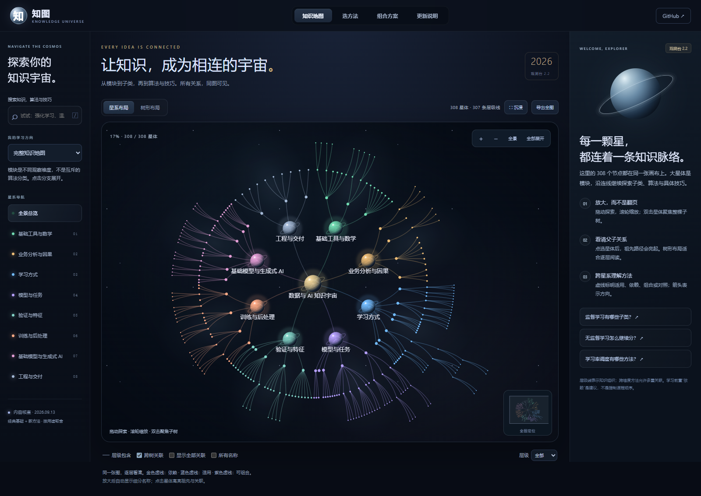

# 知图 · 知识宇宙 2.1

**先建立大结构，再理解什么时候用什么。**

[打开交互导图](https://AndyShan11.github.io/ai-learning-atlas/) · [完整文字版](./KNOWLEDGE.md) · [内容维护说明](./CONTENT_POLICY.md)



面向数据分析、Kaggle 与生成式 AI 的中文知识树。结构更新：**2026-09-13**。

- **308 个节点、307 条层级连线、119 条跨树关系**：覆盖 8 个模块，展开到最多 6 层。节点包含模块、子类与具体方法。
- **整棵树在同一画布中**，星系布局看全局，树形布局逐层读；支持缩放、拖动、折叠、搜索定位与祖先路径高亮。
- 分类 / 回归 / 排序、聚类 / 降维 / 密度估计、自监督 / 半监督等均有子树；模型、训练、验证、工程等模块也按层级展开。
- 实线表示导航包含；虚线区分适用、依赖、组合、对照。模型与任务是多对多关系，不强行塞进互斥分类。
- 每个节点解释：**是什么、什么时候用、使用边界、具体例子、关联知识、参考资料**。
- 三条学习主线、条件选择器、11 个组合方案，中英文关键词搜索与节点直达链接。
- 区分学习方式和模型维度；将余弦退火、温度缩放等技巧归入训练流程。
- 补充 LoRA / QLoRA、RAG、DPO、GRPO、TabPFN；保留仍有用的经典方法，不按年代判断淘汰。
- 桌面 / 手机可用，支持触控平移和双指缩放；导出 SVG 包含全部节点与名称，不受折叠或层级过滤影响。

## 操作

视觉版 2.2：深空观测台界面、柔和星云与星环、更清晰的模块标签；鼠标悬停预览知识点。点击“沉浸”放大工作区，按 Escape 返回；支持减少动态效果的系统偏好。

- 单击星体：显示详情、子节点与关系，同时高亮祖先路径。
- 双击星体：聚焦整棵子树。滚轮缩放，拖动画布平移。
- 键盘：Tab 到节点、Enter 聚焦；画布上 `+` / `−` 缩放、方向键平移、Home 回到全景。
- 放大后逐步显示名称；“所有名称”可以保持标签显示。
- “跨树关联”默认显示选中节点的关系，“显示全部关联”可查看整张关系网。

## 本地运行

需要 Node.js 22 或更新版本。页面无运行时第三方依赖，没有构建步骤。

```sh
node scripts/serve.mjs
```

打开 `http://127.0.0.1:4173`。也可用任意静态 HTTP 服务器。由于使用 ES modules，请通过 HTTP 打开，不要直接双击 HTML。

## 修改内容

`data.js` 保留第一版笔记与学习方案；`universe-data.js` 定义完整树和关系；`universe-expansion.js` 维护本轮 88 个新增节点与 64 条关联。`universe.js` 负责布局和画布交互，`app.js` 负责页面与详情。每个节点保留稳定 `id`，旧分享链接继续可用。

```sh
node --test tests/content.test.mjs
node scripts/docs.mjs
```

运行浏览器验证（需要安装 Playwright 与 Chromium）：

```sh
npm install
npx playwright install chromium
node tests/ui.mjs
```

`tests/ui.mjs` 自动启动本地服务器；设置 `ATLAS_URL` 可改测已部署页面。测试包括所有节点可达、父子和关系线、鼠标拖动与点击、两种布局、折叠与深度、搜索、完整 SVG、旧工具及移动端。截图保存在 `test-results/`。

## 发布

纯静态文件可由 GitHub Pages 托管。此仓库设置为从 `main` 分支根目录发布。CI 校验内容结构与生成文字版的一致性。

## 范围与出处

受到 [AMAI AI Expert Roadmap](https://github.com/AMAI-GmbH/AI-Expert-Roadmap) 的全景学习思路启发，界面与文字重新设计编写，未复用原版图片或源代码。本图聚焦用户的分析与建模需求，不追求覆盖全部 AI 研究领域。

参考资料以官方文档和原始论文为主。“先学 / 按需 / 进阶”是编辑建议，不是算法排名或行业淘汰结论。核查日期不意味着每个链接永久不变；具体实现和版本限制以资料为准。

MIT License。

## 2.1 内容审计

对照其他路线图和官方资料补齐 8 个模块，并更新三条学习主线。详见 [查漏记录](./COVERAGE_AUDIT.md)。新增年份不表示算法诞生年份；经典方法与快速迭代的模型家族分别说明边界。
